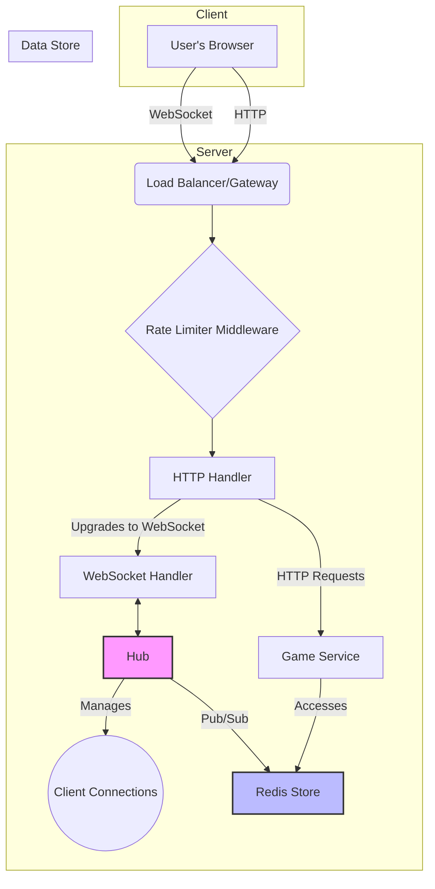

# Magic Board Server

## Overview

Magic Board is a real-time, interactive web application that allows multiple users to collaborate on a shared digital canvas. This project serves as the backend server, powering the real-time communication and state management for the Magic Board application. It is designed to be scalable, resilient, and maintainable, showcasing best practices in backend development with Go.

This project was built as an assignment to demonstrate proficiency in building robust, real-time systems.

## Features

*   **Real-time Collaboration:** Multiple users can join a session and see updates from other users in real-time.
*   **WebSocket Communication:** Utilizes WebSockets for low-latency, bidirectional communication between the client and server.
*   **Scalable Architecture:** The use of a central `Hub` for managing WebSocket connections and a Redis-based store allows for horizontal scaling.
*   **Rate Limiting:** Protects the server from abuse and ensures fair usage with a token bucket-based rate limiter.

## Tech Stack

The project is built with a modern and robust technology stack:

*   **Language:** [Go](https://golang.org/) (Golang)
*   **Real-time Communication:** [Gorilla WebSocket](https://github.com/gorilla/websocket)
*   **Database/Store:** [Redis](https://redis.io/) for fast, in-memory data storage to manage session state.
*   **Containerization:** [Docker](https://www.docker.com/) & [Docker Compose](https://docs.docker.com/compose/) for consistent development and deployment environments.
*   **Routing:** In built standard lib

## Architecture

The server follows a clean and modular architecture, separating concerns for better maintainability and testability.



*   **main.go**: The entry point of the application. It initializes the configuration, database connections, and starts the HTTP server.
*   **ws**: This package handles all WebSocket-related logic.
    *   `hub.go`: The `Hub` is the core of the real-time functionality. It manages active clients, and broadcasts events to all clients in a session.
    *   `client.go`: Represents a single WebSocket connection from a user. It handles reading and writing messages to the client.
    *   `handler.go`: The HTTP handler responsible for upgrading HTTP connections to WebSocket connections.
*   **store**: This package provides an abstraction for data storage.
    *   `redis_store.go`: The Redis implementation of the store interface. It uses Redis for storing and retrieving session or game state. This allows the application to be stateless, which is crucial for scalability.
*   **game**: Contains the core business logic of the application (e.g., what happens when a user draws on the board).
*   **middleware**:
    *   `rate_limiter.go`: An HTTP middleware to prevent abuse by limiting the number of requests from a single IP address.
*   **config**: Manages application configuration, loading settings from environment variables or a configuration file.
*   **utils**: Contains shared utility functions used across the application.

## How it Works

1.  A user connects to the server via a WebSocket client in their browser.
2.  The HTTP server receives the request, and the `rate_limiter` middleware checks if the user has exceeded their request limit.
3.  The `ws.Handler` upgrades the HTTP connection to a WebSocket connection.
4.  A new `ws.Client` is created for the user and registered with the `ws.Hub`.
5.  When a user performs an action (e.g., drawing on the board), a message is sent through their WebSocket connection to the server.
6.  The `ws.Client` receives the message and passes it to the `ws.Hub`.
7.  The `ws.Hub` processes the message and broadcasts the event to all other clients in the same session. It may also interact with the `game.Service` to update the state in the `store.RedisStore`.
8.  All connected clients receive the broadcasted message and update their UI accordingly, resulting in a real-time collaborative experience.

## Optimizations & Scalability

*   **Stateless Application:** By storing session state in an external store (Redis), the application servers themselves are stateless. This allows for horizontal scaling by simply adding more instances of the server behind a load balancer.
*   **Efficient Concurrency with Go:** Go's lightweight goroutines are used to handle each WebSocket client concurrently, allowing the server to manage thousands of simultaneous connections efficiently.
*   **Redis for Speed:** Redis is an in-memory data store, providing extremely fast read and write operations for session management and real-time state changes.
*   **Rate Limiting:** Prevents individual users from overwhelming the server, ensuring a stable experience for all users.

## How to Run

To run the server locally, you will need [Docker](https://www.docker.com/) and [Docker Compose](https://docs.docker.com/compose/) installed.

1.  **Clone the repository:**
    ```bash
    git clone <your-repo-url>
    cd magic-board-server
    ```

2.  **Set up environment variables:**
    Create a `.env` file in the root of the project and add the necessary environment variables.
    ```env
    # Example .env file
    REDIS_ADDR=redis:6379
    SERVER_PORT=8080
    ```

3.  **Run with Docker Compose:**
    ```bash
    docker-compose up --build
    ```
    This will build the Go application, start a Redis container, and run the server. The server will be available at `http://localhost:8080`.

---You've used 57% of your weekly rate limit. Your weekly rate limit will reset on 11 May at 5:30. [Learn More](https://aka.ms/github-copilot-rate-limit-error)